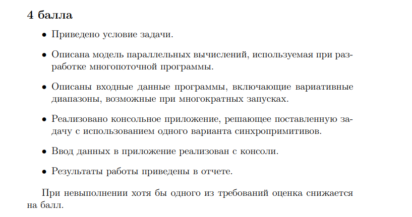

# Индивидуальное домашнее задание по АВС №4

Вариант №3

---

**Ориентируемся на 7 баллов** :(

**Модель паралельных вычислений**

В программе используется модель - **КЛИЕНТЫ И СЕРВЕР** - в качестве СЕРВЕРА выступает основной поток, который ждет запросов от потоков КЛИЕНТОВ и действует в соотвествии с поступившим запросом.

**Взодные данные** 

Входными данными является информация о клиентах - Их имена и срок остановки в отеле.

В зависимоти от срока прибывания каждого клиента, программа может образовывать различные сценарии. Например, если клиентов меньше чем номеров, то все они будут заселены сразу. В другом случае клиенты могут образовывать очередь и ждать освобождившихся номеров.

**Консольное приложение**

[Код на с++](/1.cpp)

---

**Комметарии добавлены в файл**

**Сценарий работы программы**

Есть ОТЕЛЬ - главный поток, после считывания списка клиентов, отель начинает их регистрацию и заселение в порядке очереди. Ресурс ОТЕЛЯ - 30 номеров, поэтому первые 30 клиентов после небольшого ожидания у ресепшена смогут сразу заселится на необходимый им срок. Остальные клиенты будут ждать в очереди на скамейке, пока никто из заселившихся не выселится. Как только чей то строк подходит к концу, номер освобождается и в него заселяют первого клиента в очереди, тем самым очередь смещается на 1.

**Реализация сценария**

Ресурс главного потока (Отеля) - кол-во номеров - переменная COUNT_ROOMS

Клиенты - создаваемые потоки с помощью функции <pthread_create(&thread[i], nullptr, clientRegistration, (void*)&visitors[i]);>

Так же для отслеживания заполняемости отеля используется Семафор <sem_t semaphore;>

Клиенты-потоки работают по следующему алгоритму:

1. Если счетчик семафора больше нуля = есть места, то клиент заселяется на N дней - в программе это реализовано как <sleep(10 * N_DAY)> Тоесть 1 день клиента приравнивается к 10 секундам нашего времени. 
2. После проживания, клиент покидает отель - sem_post - освобождает занимаемый ресурс
3. Если на 1ом этапе номеров нет, то за счет sem_wait клиент ждет пока не появится свободные номера, и только тогда переходит ко 2ому пункту. 

После закрытия отеля незабываем сделать sem_destroy

**Ввод данных из командной строки** 

Ввод данных реализоован через командную строку реализован как ввод имен файлов. Так как я не вижу смысла вводить кучу имен и дней через командную строку - это не удобно и неинформатиыно. 

Сами данные подразумевают под собой список имен и дней прибывания клиентов (как можно увидеть на скрине выше). Поток клиентов должен заканчиваться словом close - отель закрывается для новых клиентов и больше новых посетителей не обслуживает.

Условно говоря, отель сначала получает все запросы на регистрацию а потом начинает их обрабатывать.

Как было видно на скрине выше, ввод и вывод реализованы и работают.

На данном скрине продемонстрирован другой сценарий программы, когда не образуется очереь и все клиенты сразу же расселяются.

Стоит отметить что при тестировании я использую отель с 3 комнатами, чтобы не загромаждать ввод и вывод и проработать несколько сценариев.

Для этого только надо поменять значение при инициализации семафора и изменить значение переменной COUNT_ROOMS

Рассмотрим работу программы с клиентами и очередью из первого скрина.

    bob 3
    nil 2
    ron 2
    sam 1
    den 2
    close
  
Пргорамма считывает все имена, а потом запускает потоки клиентов. Первым на регистрацию подходит bob, он немного ждет и так как номеров еще хватает (3шт. из скриншота) он заселяется. Далее к регистрации подхоит nil и ron - они так же заселяются. А вот для sam уже номеров нет. Он встает в очередь (перед ним 0 человек - он превый). Den так же встает в очередь. Как только nil выселяется - первый человек в очереди - sam заселяетсяю, после выселения ron заселяется den. Теперь все клиенты обслужены и осталось дождаться когда все завершат свое проживания и выселятся. После этого отель закрывается окорнчательно (программа завершается). 
    

